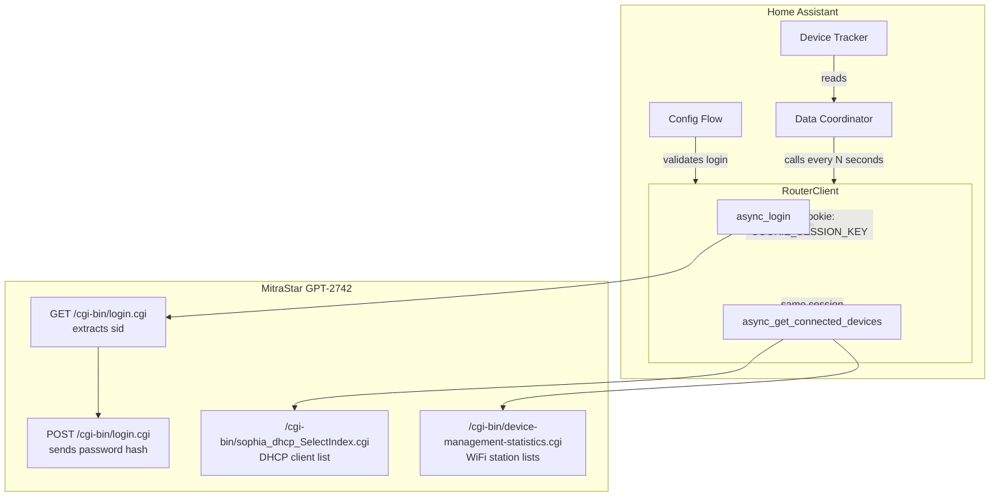
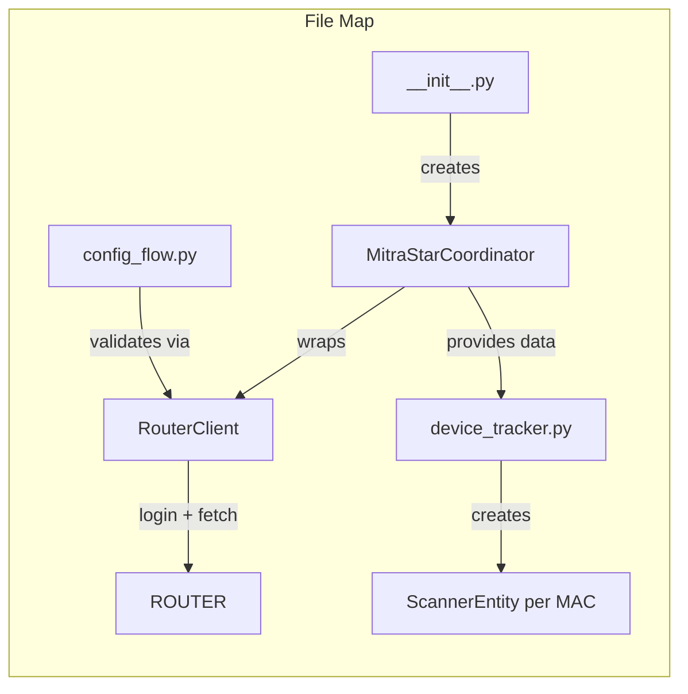

# MitraStar GPT-2742 Router — Home Assistant Integration

Device tracker for the MitraStar GPT-2742 router (VIVO branded) using the modern config-flow pattern. Password is stored securely in Home Assistant's encrypted configuration entry storage.



## Features

- Two-step password authentication (SHA-1 challenge + MD5 hash with sid)
- Tracks connected devices from DHCP client list and WiFi station lists
- Resolves device hostnames from DHCP leases
- Modern config-flow setup (no YAML required)
- Encrypted credential storage via Home Assistant config entry

## Installation (HACS)

1. Copy the `custom_components/mitrastar_gpt_2742` directory to your Home Assistant `custom_components` directory.
2. Restart Home Assistant.
3. Go to **Settings → Devices & Services → Add Integration**.
4. Search for **MitraStar GPT-2742 Router**.
5. Enter the router IP, username (default: `admin`), and password.

## Authentication Flow

1. `GET /cgi-bin/login.cgi` — retrieves a login page containing a `sid` (session ID) in JavaScript
2. `POST /cgi-bin/login.cgi` — sends `Loginuser`, `LoginPasswordValue = MD5(url_encoded(password).lowercase + ":" + sid)`, `acceptLoginIndex=1`
3. On success: the response contains `Set-Cookie: COOKIE_SESSION_KEY=...` and a JavaScript redirect to `sophia_index.cgi`
4. Subsequent requests reuse the same `ClientSession` (the cookie is automatically sent)

## Data Flow

The `RouterClient` manages its own `aiohttp.ClientSession` with `TCPConnector(ssl=False)` (the router runs plain HTTP on port 80). Each poll cycle:

1. `async_login()` — authenticates and establishes the session cookie
2. `async_get_connected_devices()` — fetches two pages:
   - `/cgi-bin/sophia_dhcp_SelectIndex.cgi` — HTML `<select>` listing all DHCP clients with hostname, MAC, and IP
   - `/cgi-bin/device-management-statistics.cgi` — HTML tables of WiFi-connected devices on 2.4 GHz and 5 GHz bands
3. MACs are deduplicated and returned alongside their hostname mappings

## Component Architecture

```
custom_components/mitrastar_gpt_2742/
├── __init__.py          # MitraStarCoordinator + async_setup_entry / async_unload_entry
├── manifest.json        # Component metadata (domain, version, requirements)
├── config_flow.py       # UI-based setup with encrypted password storage
├── const.py             # Domain constant and default values
├── device_tracker.py    # ScannerEntity per connected device (dynamic add/remove)
├── router.py            # RouterClient — all HTTP logic (no Home Assistant dependency)
└── strings.json         # UI localization strings
```



## Testing

Integration tests hit the real router and require credentials:

```bash
# Set up
cp .env.example .env   # edit with your router credentials
source venv/bin/activate
pip install -r requirements.txt

# Run all integration tests
python -m pytest tests/ -v
```

Tests verify:
- Login succeeds with correct credentials
- Login fails with incorrect credentials
- Connected devices return at least one MAC
- MAC addresses match valid format
- DHCP hostname MACs are a subset of connected device MACs

## License

GNU General Public License v3.0
